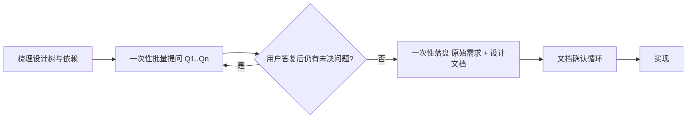

# 需求1：设计阶段提问规范

## 需求简介

将「持续追问、逐分支确认、Q 编号四要素」的设计阶段提问规范固化进 story-lite 插件的 SKILL.md，并同步版本号与 README。

## 功能说明

- 策划目标：设计（及任何出现疑问的环节）以结构化问题与用户逐条对齐，禁止脑补、不预设答案；细节确认前不落文档。
- 技术行为：修改 `plugins/story-lite/skills/story-lite/SKILL.md`（新增章节 + 改写 Design 流程）；bump `.claude-plugin/plugin.json` 与 `.codex-plugin/plugin.json` 版本号；同步根 README 的版本与描述。纯文档/配置改动，无运行时代码，不涉及网络同步与异常处理。

## 设计细节

### 决策记录（已与用户逐条确认）

| Q | 决策点 | 结论 |
|---|--------|------|
| Q1 | 任务目标范围 | 修改 story-lite 插件（SKILL.md + 按需 README），不动其他插件 |
| Q2 | 规则落位方式 | SKILL.md 内新增独立章节，自包含、不跨插件引用 |
| Q3 | 文档落盘时机 | 细节全部确认前不落任何文档；确认后一次性落原始需求 + 设计文档，再走文档确认循环 |
| Q4 | 提问格式 | Q 递增编号（Q1、Q2…）+ 四要素必填（标题/原因/可选项/推荐选项及其原因），不强制分类与分隔符 |
| Q5 | 适用范围 | 所有出现疑问/不确定的地方均按此方式提问；不预设用户答案、禁止脑补 |
| Q6 | 版本与 README | bump 0.1.1 / 0.1.1+codex.20260802000627，README 同步 |
| Q7 | 提问方式 | 批量提问：一次性提出当前设计树全部未决问题，不逐个提问；答复引出新问题时下一轮再批量提出，迭代直至完全一致 |

### SKILL.md 变更草案

- 新增章节「设计阶段提问规范」，置于「约定」之后、工作流程之前：
  - 核心行为：先遍历设计树、按依赖顺序梳理全部决策点，然后一次性批量提出所有未决问题（Q 编号 + 四要素）；用户答复后若产生新问题，下一轮继续批量提出，迭代直到完全一致；
  - 查证优先：问题可通过代码库得答案 → 先用 ast-grep / rg / fd 检索再做决策；
  - 禁止使用 `askuserquestion` 工具；
  - 提问格式：Q1、Q2…递增编号，每问附标题、原因、可选项、推荐选项及其原因；
  - 适用范围：所有环节（需求整理/Quick/TDD/Design/Review）出现疑问时均适用，不预设用户答案；
  - 文档纪律：细节确认前不落任何文档；确认后一次性落盘，再走文档确认循环。
- Design 模式流程改写：需求整理 → 对话提问澄清（Q1…Qn）→ 全部细节确认 → 落盘设计文档 → 展示确认 → 实现。

### 版本与文档同步

- `plugins/story-lite/.claude-plugin/plugin.json`：0.1.0 → 0.1.1
- `plugins/story-lite/.codex-plugin/plugin.json`：0.1.0+codex.20260801154629 → 0.1.1+codex.20260802000627
- 根 `README.md`：story-lite v0.1.0 → v0.1.1；skill 表格中 story-lite 描述更新为含「设计阶段先提问后落盘」的表述

## 变更记录

- 2026-08-02 00:06：初始创建
- 2026-08-02 00:07：按用户反馈，提问方式改为「一次性批量提出全部未决问题」，流程图中同步更新
- 2026-08-02 00:09：设计确认；实现完成——SKILL.md 新增「设计阶段提问规范」章节并改写 Design 模式流程；.claude-plugin/plugin.json → 0.1.1；.codex-plugin/plugin.json → 0.1.1+codex.20260802000627；根 README 版本与描述同步
