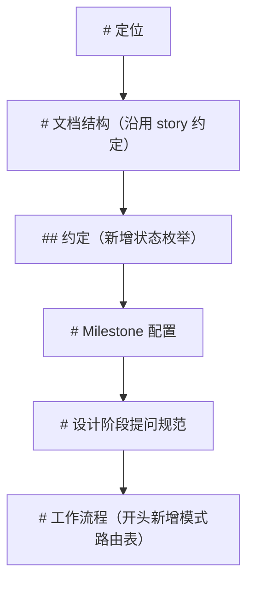
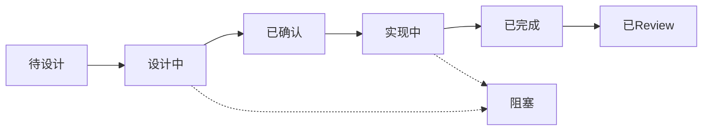

# 需求2：插件结构优化

## 需求简介

对 story-lite 单文件结构做纯结构优化：章节归类、触发词路由表、六类模板补齐（内联）、总览状态枚举；不改任何工作流步骤与效果。

## 功能说明

- 策划目标：让 SKILL.md 的组织更清晰、模式路由更确定、文档产出更一致，同时严格保持现有流程（定位 → 需求整理 → TDD → 设计 → 实现 → Review → 整合 → 总结）与效果不变。
- 技术行为：纯文档修改，只动 `plugins/story-lite/skills/story-lite/SKILL.md`，同步 `总览.md` 状态归一；版本号是否 bump（0.1.1 → 0.1.2）待用户确认（见决策 Q4）。无运行时代码，不涉及网络同步与异常处理。

## 设计细节

### 决策记录

| Q | 决策点 | 结论 |
|---|--------|------|
| Q1 | 优化范围 | 只做 1-4：章节归类、触发词路由表、模板补齐、状态枚举；不做元数据自动化（候选 5）、slug 索引（6）、quick 命名序号（7） |
| Q2 | 模板落位 | 全部内联进 SKILL.md，保持单文件自包含，不拆 references |
| Q3 | 元数据同步机制 | 维持手工维护，不加脚本、不复用 git-plugin 的 update-version |
| Q4 | 版本号（待确认） | 方案 A：0.1.1 → 0.1.2（双 manifest + README 手工同步，推荐，符合插件变更惯例）；方案 B：维持 0.1.1 |

### 变更 1：章节归类

现状问题：

- `## Milestone 配置` 嵌套在 `# 设计阶段提问规范` 内，语义错误；
- 静态约定（文档结构 / 约定 / Milestone 配置）与动态流程（工作流程）混排。

目标结构（内容与流程不变，仅调整顺序与层级）：



### 变更 2：触发词 → 模式路由表

工作流程开头新增「模式路由」小节，映射用户触发词到 9 个模式：

| 用户触发 | 命中模式 |
|----------|----------|
| 描述新需求 / 「做 XX」 | 1 定位 → 2 需求整理 |
| 简单独立任务（加日志、debug、小改动） | 3 Quick（与用户确认） |
| 「拆分」/ 多需求点大需求 | 4 TDD（可选） |
| 「设计」/「写设计文档」 | 5 Design |
| 「实现」/「开工」 | 6 实现与同步维护 |
| 「review」/「审查」 | 7 Review（先确认设计或代码） |
| 「整合」/「生成总览」/ 里程碑收尾 | 8 整合 |
| 「总结」 | 9 总结 |

### 变更 3：模板补齐（全部内联）

每个模板均为现有文字规则的显式化，不引入新规则：

1. **原始需求.md**（第 2 节）

```
# 原始需求：<slug 描述>
- <YYYY-MM-DD HH:mm>：初始创建
（后续变更记录继续追加在标题下）
## 需求背景
## 需求描述
## 验收标准
```

2. **quick 文档**（第 3 节）

```
# Quick：<任务短语>
- 日期：YYYY-MM-DD
- 需求：一句话简介
## 方案
## 改动文件
## 结果/状态
```

3. **TDD.md**（第 4 节）

```
# TDD：<slug 描述>
- <YYYY-MM-DD HH:mm>：初始创建
## 需求点清单
| 编号 | 名称 | 目标 | 功能范围 | 方案思路 |
|------|------|------|----------|----------|
| 1 | … | … | … | … |
## 依赖图
（mermaid flowchart，体现需求点依赖）
```

4. **设计文档**（第 5 节，现有模板代码块化）

```
# 需求N：<标题>
## 需求简介
一句话。
## 功能说明
策划目标 + 技术行为。
## 设计细节
图文并茂（mermaid），代码用伪代码表达；关注网络同步、原生 API 优先、复用与异常处理。
## 变更记录
- <YYYY-MM-DD HH:mm>：初始创建/修改
```

5. **总览.md**（第 6 节）

```
# 总览：<slug 描述>
## 需求点 N：<标题>
- 状态：<枚举值>
- 关键决策：…
- 设计文档：<链接>
- Review：<链接>
## 变更记录
- <YYYY-MM-DD HH:mm>：说明
```

6. **review 报告**（第 7 节）

```
# 需求N_标题_设计review / 需求N_标题_代码review
- 日期：YYYY-MM-DD
- 关联需求：需求N_标题
## 问题清单
| 编号 | 问题 | 原因 | 影响面 | 建议 |
|------|------|------|--------|------|
## 修复记录（历史保留，复查后原地更新）
```

### 变更 4：状态枚举

在「约定」中新增：

- 总览状态枚举（唯一取值）：待设计 / 设计中 / 已确认 / 实现中 / 已完成 / 已Review / 阻塞



- 已 Review 且问题清零归为「已Review」；需求1 现有表述「设计已确认，实现已完成（Review 按需）」归一为「已完成」。

## 验收标准

- SKILL.md 章节顺序为「定位 → 文档结构与约定 → 提问规范 → 工作流程」，Milestone 配置不再嵌套在提问规范下；
- 工作流程开头有「触发词 → 模式」路由表；
- 六类模板全部内联且与现有规则一致；
- 约定含状态枚举，总览使用枚举值；
- 工作流 9 个模式步骤、quick/正式规则、review 流程、提问规范内容保持不变；
- 版本号与 README 按 Q4 决定执行。

## 变更记录

- 2026-08-02 00:18：初始创建（Q1 选 1-4、Q2 模板内联、Q3 手工同步已确认；Q4 版本号待确认）
- 2026-08-02 00:28：设计确认；实现完成——SKILL.md 章节重排（Milestone 配置移出「设计阶段提问规范」并置于「约定」之后）、新增模式路由表、六类模板内联、约定新增总览状态枚举；.claude-plugin/plugin.json → 0.1.2，.codex-plugin/plugin.json → 0.1.2+codex.20260802002817，根 README 同步
