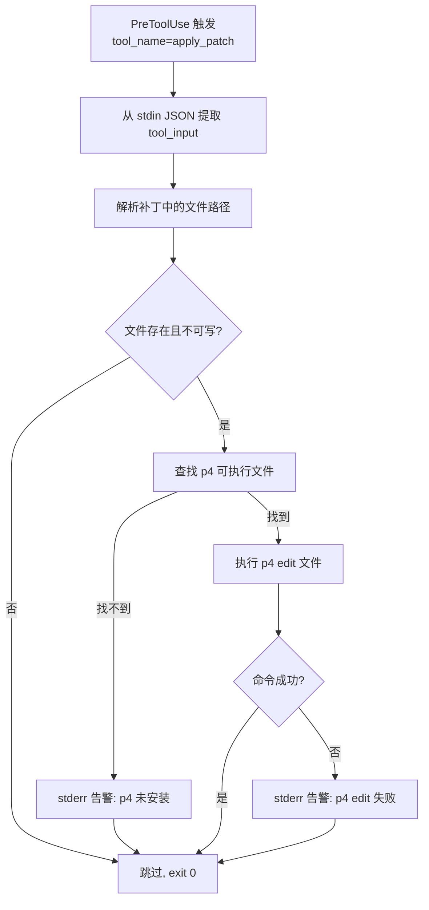

# 需求1：编辑前 p4 edit hook

## 需求简介

项目级 p4 编辑解锁 hook：Codex 与 Claude Code 在编辑文件前，先对目标文件尝试 `p4 edit` 解锁（best-effort），避免只读文件写入失败；由配置技能安装到目标项目，只在项目目录内生效。

## 功能说明

**策划目标**：让 agent 在 p4 托管的工作区中能正常修改文件，无需用户手动 `p4 edit`；同时不干扰非 p4 项目（git 等）。hook 只在目标项目内生效，不写用户级配置。

**技术行为**：
- Codex 挂在 `PreToolUse` 事件上，匹配文件编辑工具 apply_patch；Claude Code 挂在 `PreToolUse` 上，匹配 Write/Edit/MultiEdit；两端共用同一个脚本；
- 钩子从 stdin JSON 读取 `tool_name` 与 `tool_input`，解析出本次编辑涉及的文件路径；
- 仅对「存在且不可写」的文件执行 `p4 edit <路径>`（走默认 changelist）；
- 任何失败（p4 不存在、文件不受托管、命令报错）都只向 stderr 告警，退出码 0 放行；
- 新文件（Add）不尝试解锁；Delete 与 Update 尝试解锁。

## 设计细节

### 配置落点（项目级，由 p4-hook-install 技能安装）

目标项目内生成：

```
<project>/
├── .codex/
│   ├── hooks.json            # Codex 项目级 hooks（仅该项目生效）
│   └── hooks/
│       └── p4-edit-hook.py   # 共用脚本（随项目提交）
└── .claude/
    └── settings.json         # Claude Code 项目级 settings（合并追加，保留已有配置）
```

**Codex 端**——`.codex/hooks.json`（项目级，可提交 git）：

```json
{
  "hooks": {
    "PreToolUse": [
      {
        "matcher": "apply_patch",
        "hooks": [
          {
            "type": "command",
            "command": "/usr/bin/python3 /<项目绝对路径>/.codex/hooks/p4-edit-hook.py"
          }
        ]
      }
    ]
  }
}
```

**Claude Code 端**——`.claude/settings.json`（与 `settings.local.json` 分离；若已存在则合并 hooks 键，保留其他键）：

```json
{
  "hooks": {
    "PreToolUse": [
      {
        "matcher": "Edit|Write|MultiEdit|NotebookEdit|apply_patch",
        "hooks": [
          {
            "type": "command",
            "command": "/usr/bin/python3 /<项目绝对路径>/.codex/hooks/p4-edit-hook.py",
            "timeout": 30000,
            "permission": "allow"
          }
        ]
      }
    ]
  }
}
```

说明：
- 脚本与配置都进项目目录，作用域天然项目级，可随 git/版本库共享；
- hook 命令引用脚本用**安装时写入的绝对路径**（目标项目可能是 p4 工作区、未必是 git 仓库，不依赖 `git rev-parse`）；项目移动后需重跑安装技能（幂等）；
- Codex 项目 hooks 仅在项目处于 trusted 且用户在 `/hooks` 审查信任后触发；Claude Code 项目级 hook 首次运行可能弹审批（`permission: "allow"` 预置可免）；
- 两端 timeout 单位不同（Codex 秒 / Claude 毫秒），因此各自配置文件里按各自语义写，共用脚本不含端特定逻辑。

### Hook 脚本行为（`<project>/.codex/hooks/p4-edit-hook.py`，双端共用）

**统一路径提取**：脚本同时兼容两种 stdin 形态——
- Codex apply_patch：`tool_input.command` 为补丁文本，解析 `*** Add/Update/Delete File:` 与 `*** Move to:` 行；
- Claude Code Write/Edit/MultiEdit：`tool_input.file_path` 直接给出路径；同时读取 `CLAUDE_FILE_PATHS`/`CLAUDE_FILE_PATH` 环境变量兜底；
- 相对路径统一拼接 `cwd` 后再去重。



伪代码：

```python
data = json.load(sys.stdin)

paths = set()
paths |= data.tool_input.file_path       # Claude Code Write/Edit/MultiEdit
patch = data.tool_input.command          # Codex apply_patch，兜底键 patch/input
paths |= parse_paths_from_patch(patch)   # 正则 "*** (Add|Update|Delete) File: <p>" 与 "*** Move to: <p>"
paths |= env.CLAUDE_FILE_PATHS.split()   # 环境变量兜底

for p in paths:
    p = os.path.join(data.cwd, p) if not absolute(p) else p
    if not os.path.exists(p) or os.access(p, W_OK):
        continue                    # 新文件/已可写，无需解锁
    p4 = locate_p4()                # 环境变量 > PATH > 常见安装路径
    if p4 is None:
        warn("p4 未找到，跳过解锁"); continue
    r = run([p4, "edit", p])
    if r.returncode != 0:
        warn("p4 edit 失败: " + r.stderr)   # 非 p4 托管等，放行
sys.exit(0)                          # 永不阻断编辑
```

关键点：
- **路径解析**：apply_patch 的补丁文本以 `*** Add File: xxx` / `*** Update File: xxx` / `*** Delete File: xxx` / `*** Move to: xxx` 标注文件；正则提取后相对路径拼接 `cwd`；
- **双端兼容**：优先取 `tool_input.file_path`（Claude 形态），取不到再解析补丁文本（Codex 形态），两路并集去重；
- **p4 查找顺序**：环境变量 `CODEX_P4_HOOK_P4`（显式指定）→ `shutil.which("p4")` → 常见安装路径（`/usr/local/bin/p4`、`/opt/homebrew/bin/p4`、`~/bin/p4`、`/Applications/p4v.app/Contents/Resources/p4`）；
- **失败放行**：`p4 edit` 对非托管文件报错是常态（如 git 仓库），一律告警后放行；
- **只读检测**：已可写的文件跳过 p4 调用，减少对非 p4 项目的噪音；
- **异常兜底**：脚本任何异常都捕获并 exit 0，绝不让 hook 自身阻断编辑。

### 备注：Claude Code 原生 Perforce 模式

Claude Code 2.1.x 内置 `CLAUDE_CODE_PERFORCE_MODE` 环境变量开关（注入「只读文件先 `p4 edit`」的提示，靠模型自觉）。本需求不依赖它——hook 是确定性行为；如需叠加，可在启动 Claude Code 时设置该变量，但不属于本需求实现范围。

## 变更记录

- 2026-08-02 11:11：初始创建
- 2026-08-02 11:14：范围更新——增加 Claude Code 端配置，两端共用同一脚本；新增双端差异说明与原生 Perforce 模式备注
- 2026-08-02 14:30：范围更新——改为随 story-lite 插件分发（撤销用户级配置方案）
- 2026-08-02 14:33：回滚——撤销随插件分发方案，恢复用户级双端配置方案
- 2026-08-02 14:38：落点调整——hook 改为项目级部署（配置与脚本进项目目录），由 p4-hook-install 技能安装，仅在项目内生效
- 2026-08-02 14:43：实现完成——hook 脚本与配置模板随技能 assets 落盘，install/uninstall 端到端验证通过（含幂等、保留用户配置、空格路径、干净卸载）
