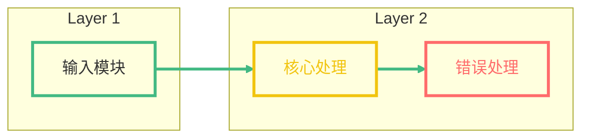
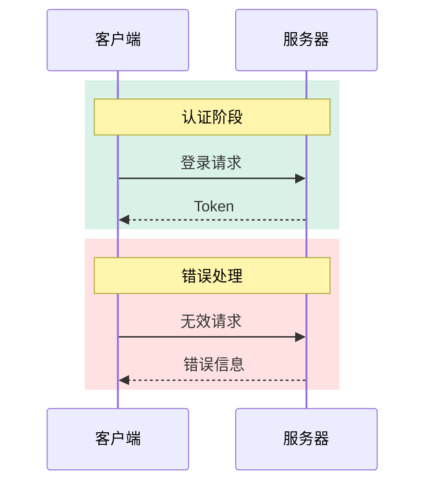

## Mermaid 样式规范

**架构图/流程图**:


**时序图**:


---

### 颜色速查表

| 颜色 | 色值 | 应用场景 | 样式类 |
|------|------|----------|--------|
| 薄荷绿 | #42b983 | 普通节点、正常流向 | default |
| 金黄色 | #f1c40f | 重要模块、关键路径 | `:::highlight` |
| 珊瑚红 | #ff6b6b | 错误处理、异常情况 | `:::important` |
| 天蓝色 | #3498db | 辅助模块、次要功能 | `:::subcomponent` |

---

## 文档结构模板

### YAML Frontmatter

```yaml
---
tags: [AIGen, Key1, Key2]
created: 2026-01-27
author: borlusezhao with Claudecode
project: {{project}}
source_path: {{FilePath}}
---
```

**规则**:
- `tags`: 3-5 个关键词，如 `操作`, `UE`, `Lua`, `输入系统`
- `created`: 当前日期 (YYYY-MM-DD)
- `project`: 从项目路径提取的项目名称
- `source_path`: 目标文件的完整路径

---

### 1. 综述 (Overview)

> [!SUMMARY] 核心摘要
> 用一两句话高度概括该模块/文件的核心职责和作用。

- **核心目标**: 解释该模块主要解决什么业务问题
- **适用场景**: 描述在什么情况下会使用该模块
- **主要功能点**: 简要列出 3-5 个核心功能点
- **关联文件**: 列出相关联的文件（使用简化的目录树格式）

---

### 2. 整体架构 (Architecture)

#### 2.1 逻辑架构图

使用 Mermaid 绘制架构图，**必须**包含样式定义

**包含一定的解释**，说明各层次的职责和交互关系

#### 2.2 核心类与接口

| 类/接口名 | 类型 | 职责描述 | 关键依赖 |
| :--- | :--- | :--- | :--- |
| `ClassName` | Class | 核心功能描述 | Dep1, Dep2 |
| `HelperClass` | Helper | 辅助功能描述 | Dep3 |

**类型说明**: Class/Helper/Manager/Config/Data

---

### 3. 功能详解 (Features)

针对每个核心功能，重复以下结构：

#### 3.x [功能名称]

> [!NOTE] 功能简介
> 简短描述该功能的输入、处理逻辑和输出。

**业务流程图**: 使用 Mermaid 绘制具体的流程，尽量使用 LR 方向

**实现细节与代码映射**:
1. **步骤一**: 描述逻辑... `_代码位置_: MethodName()`
2. **步骤二**: 描述逻辑... `_代码位置_: ClassName.MethodName()`

**关键代码片段**:
```language
// 引用核心代码，保留关键逻辑
if (condition) {
    doSomething(); // 关键操作
}
```

> [!TIP] 最佳实践
> 针对该功能的调用建议或配置建议。

**折叠代码示例** (超过 20 行):
> [!EXAMPLE]- 详细代码
> ```lua
> function LongFunction()
>     -- 详细代码
> end
> ```

---

### 4. 关键链路分析 (Critical Call Paths)

> [!IMPORTANT] 链路说明
> 本节选取模块中最核心、路径最长或最易出错的业务链路进行剖析。

#### 4.1 [链路名称，如：登录验证流程]

**链路可视化**: 使用 Mermaid 绘制调用链路图，**必须**包含样式定义

**调用栈详解**:
1. **入口层**: `MethodName()` - _作用_: 描述职责 | _关键点_: 关键逻辑
2. **中间层**: `LogicProcess()` - _作用_: 描述职责 | _关键点_: 关键逻辑
3. **输出层**: `ResultHandler()` - _作用_: 最终处理

---

### 5. 关联分析 (Dependencies)

#### 核心依赖层 (Core Layer)

- `FileA.lua` - 主管理器 [[WikiLink 到文档]]
- `FileB.lua` - 核心配置，定义优先级和 InputTag

#### 重要依赖层 (Important Layer)

- `HelperC.lua` - 辅助工具类，提供图标获取功能
- `DataD.lua` - 数据定义，包含配置表结构

#### 参考层 (Reference Layer)

- `UtilE.lua` - 通用工具函数
- `ConfigF.ini` - 配置文件
- ...（共 N 个参考文件）

**上游依赖**: 调用了哪些外部模块或库
**下游影响**: 该模块被谁调用（如果已知）
**数据交互**: 涉及哪些数据库表或外部 API

---

### 写作规则

#### 语言风格
- 提供清晰明了、结构化的技术解答
- 使用专业术语，同时保持可读性
- 代码注释使用简洁中文

#### 标题结构
- 每一个 header (H2, H3) 以数字标号开始
- 格式: `1. 标题`, `1.1 子标题`, `2. 标题`

#### 代码展示
- 代码块必须指定语言 (如 ```lua, ```cpp, ```csharp)
- 关键逻辑行后需添加简短注释
- 超过 20 行的代码使用折叠 Callout

#### 不确定性处理

1. 明确指出不确定的部分（使用 `>[!QUESTION]`）
2. 提供最可能正确的解决方案
3. 建议用户查阅官方文档或进行实际测试验证

**示例**:
> [!QUESTION] 待确认逻辑
> 这部分逻辑依赖于外部配置，具体行为可能需要运行时验证。

#### 容错处理

- 无法确定的路径/项目名，在 Frontmatter 中填入 `Unknown`
- 无法确定的逻辑，使用 `> [!QUESTION] 待确认逻辑` 标注
- 目标目录不存在时，Write 工具会自动创建父目录

---

### Callout 类型

| 类型 | 用途 |
|------|------|
| `>[!NOTE]` / `>[!SUMMARY]` | 简介、摘要 |
| `>[!TIP]` / `>[!HINT]` | 最佳实践、技巧提示 |
| `>[!IMPORTANT]` / `>[!WARNING]` | 关键配置、重要逻辑 |
| `>[!CAUTION]` / `>[!DANGER]` | 副作用、数据丢失风险 |
| `>[!TODO]` | 待办或未实现功能 |
| `>[!BUG]` | 潜在 Bug |
| `>[!QUESTION]` | 不确定的逻辑 |
| `>[!EXAMPLE]-` | 折叠代码示例（注意减号） |

