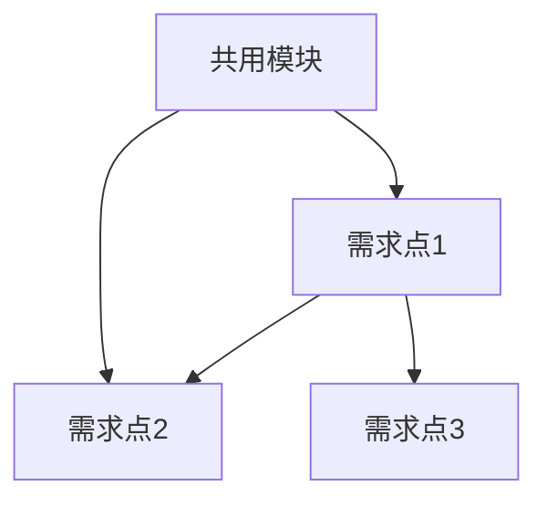

首先加载 ../../Library/common/doc-rule.md 以了解必要规则

# Epic 文档模板

用于记录大需求的整体拆分规划。只做需求规划和整体方案，不涉及具体设计细节（设计细节留给 story-design）。

```markdown
# <Epic 名称>

## 需求概述

<一段话总述整个大需求的目标、背景和核心玩法>

---

## 整体约束

- <技术约束、性能要求、平台限制等>
- <与现有系统的关系：复用/扩展/新建>

---

## 需求点清单

| # | 需求点 | 描述 | 依赖 | 复杂度 | 状态 |
|---|--------|------|------|--------|------|
| 1 | <名称> | <一句话描述> | - | 低/中/高 | 待设计 |
| 2 | <名称> | <一句话描述> | #1 | 低/中/高 | 待设计 |

> 状态：待设计 → 设计中 → 已设计 → 实现中 → 已完成

---

## 依赖关系



---

## 建议实施顺序

根据依赖关系拓扑排序，被依赖的优先：

1. **第一批（无依赖/基础设施）**：<需求点列表>
2. **第二批（依赖第一批）**：<需求点列表>
3. **第三批**：<需求点列表>

---

## 复用与共用设计

<识别出的共用模块/系统，说明哪些需求点会复用它们>

| 共用模块 | 被复用于 | 说明 |
|---------|---------|------|

---

## 需求点说明

> 以下对每个需求点做整体方案级说明，不涉及具体代码设计（留给 story-design）。

---

### 需求点 1：<需求点名称>

#### 需求目标

<这个需求点要解决什么问题，达到什么效果>

#### 功能范围

<分点列出包含哪些功能，明确边界：做什么、不做什么>

#### 整体方案思路

<用自然语言描述实现思路、技术方向、关键决策点，不写具体代码或接口>

#### 与其他需求点的关系

<复用了什么、被谁依赖、需要协调的地方>

#### 风险与待确认

<该需求点的风险项、不确定点>

---

### 需求点 2：<需求点名称>

（同上结构，重复展开每个需求点...）

---

## 待确认事项

<还未澄清的整体性问题，留作后续跟进>

---

## 变更记录

- **<YYYY-MM-DD HH:mm>**：初始创建
```

## 使用指导

- 需求点的粒度 = 一次 story-design 能完成的范围
- 共用模块必须拆为独立需求点，不要藏在其他需求点里
- **不写具体设计细节**：不写接口、不写类图、不写伪代码，这些留给 story-design
- 每个需求点重点说清楚：目标、范围、方案思路、与其他点的关系
- 状态字段在后续 story-design 细化或 implement 完成时手动更新
- 实施顺序要考虑依赖关系，也要考虑风险（高风险的优先验证）
- 后续用 `/story-design` 细化某个需求点时，以此文档作为输入上下文
